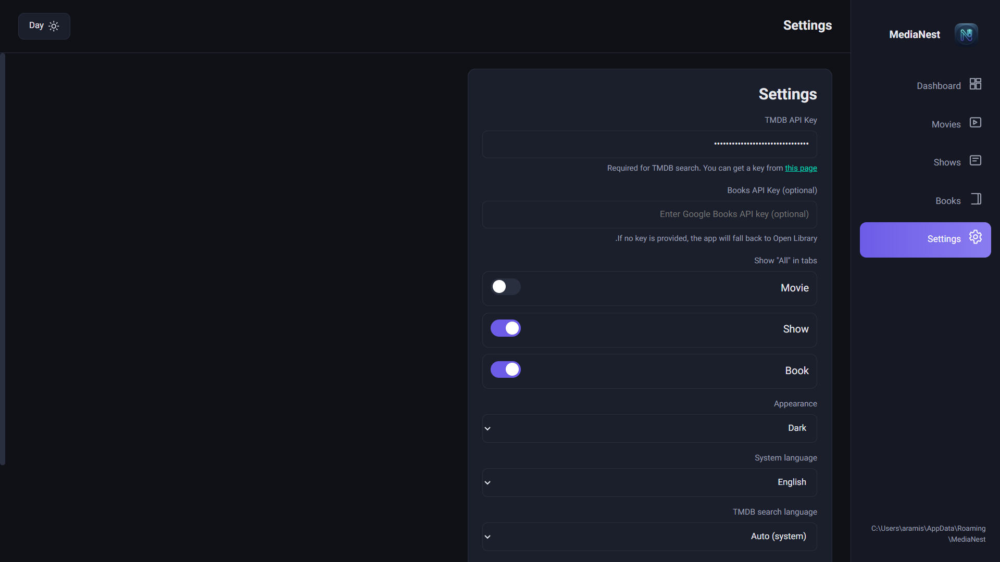
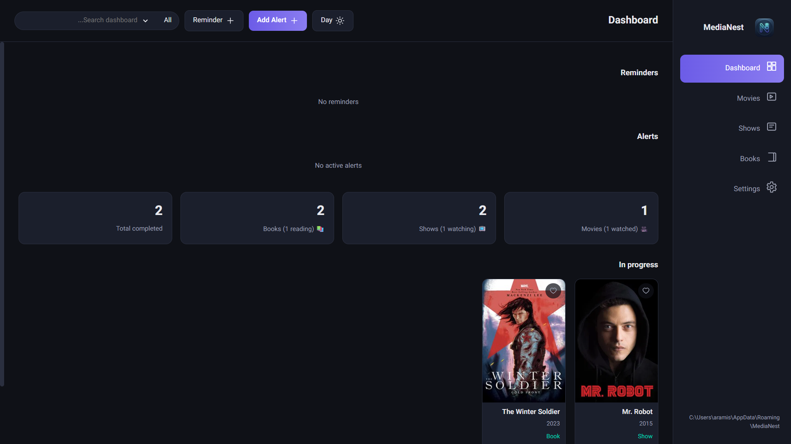
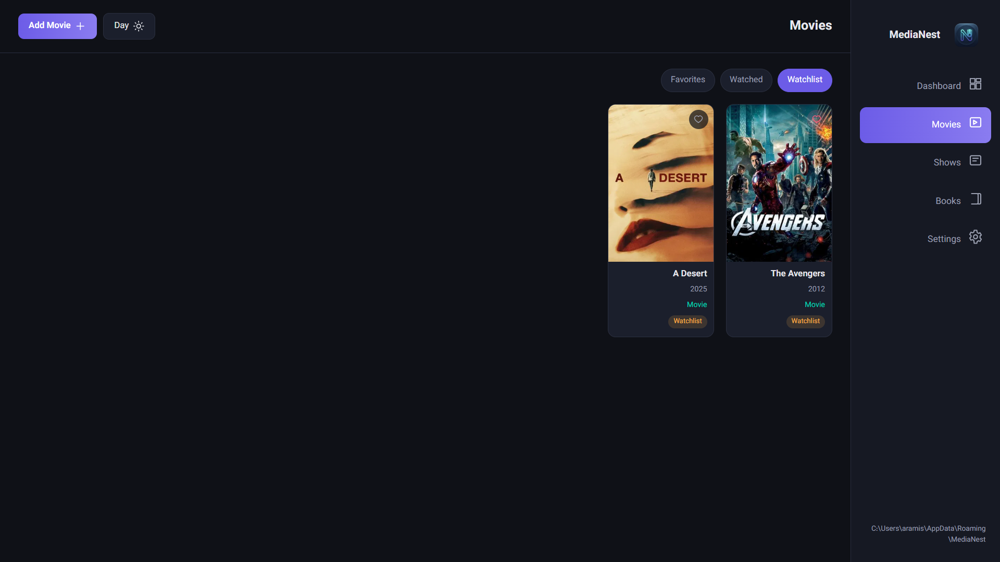
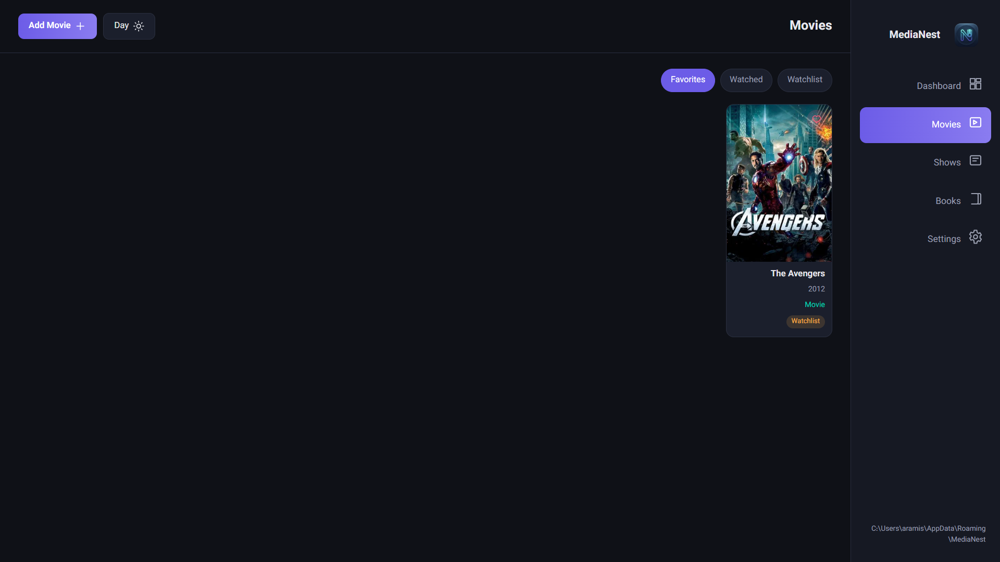
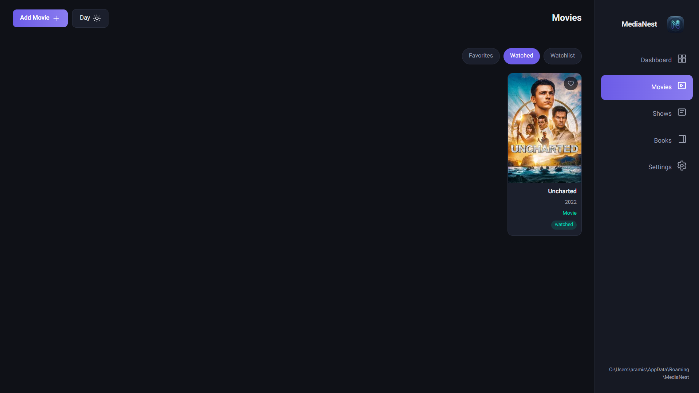
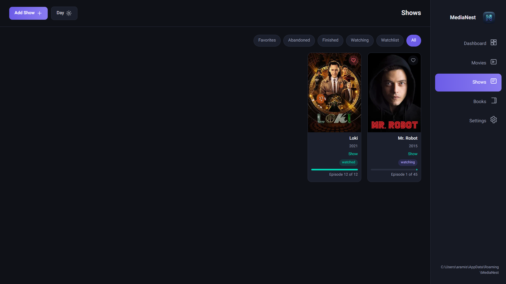
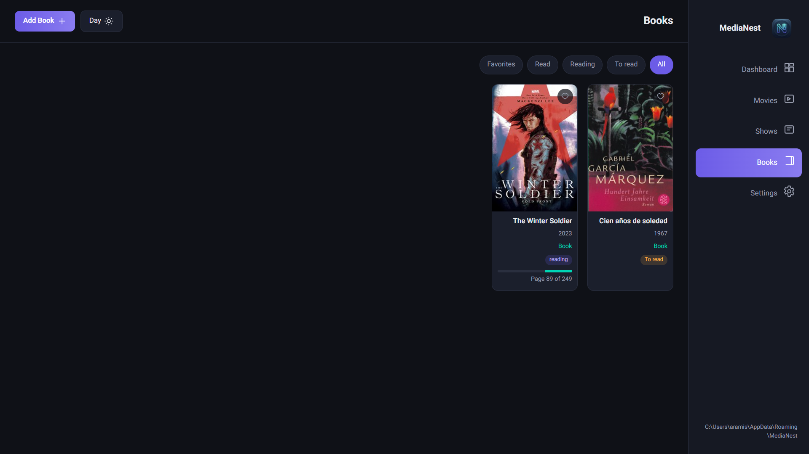

---

# 🎬📚 MediaNest

A modern desktop application for managing **movies, TV shows, and books** — inspired by TV Time, built for Windows.

---

## ✨ Overview

**MediaNest** is a cross-media tracking app that allows you to organize and track:

* 🎞️ Movies
* 📺 TV Shows
* 📚 Books

Built with Electron, it provides a fast, clean, and offline-first experience for managing your personal entertainment library.

---

## 🚀 Features

* 🎬 Track movies, TV shows, and books
* ⭐ Add items to **Favorites**
* 📺 Keep track of watched episodes / reading progress
* 🔎 Fast search for content
* 🌍 Multi-language support (language switching)
* 📂 Organized media lists (Watched / Watching / Plan to watch)
* 🧠 Continue from last progress
* 💾 Local storage (fully offline support)
* 🎯 Simple UI inspired by TV Time
* 🪟 Windows installer included

---

## 🧰 Tech Stack

* Electron.js
* Node.js
* JavaScript (Vanilla)
* HTML5
* CSS3

---

## 📦 Installation

### 🔧 Development mode

```bash id="xq1k2a"
npm install
npm start
```

---

### 🪟 Windows Installation

You can install the app using the included Windows installer (if available in releases).

---

## 📁 Project Structure

```id="p0c9vd"
MediaNest/
│
├── main.js
├── preload.js
├── package.json
├── package-lock.json
├── LICENSE.txt
│
├── icon.png
├── icon2.ico
│
├── assests/
│   └── screenshots/
│
├── src/
│   ├── index.html
│   ├── renderer.js
│   └── styles.css
```

---

## 📸 Screenshots

A preview of MediaNest interface across different sections:

### ⚙️ Settings


### 🏠 Dashboard


### 🎬 Movies – Watchlist


### ⭐ Movies – Favorites


### ✅ Movies – Watched


### 📺 TV Shows


### 📚 Books

---

## 🎯 Project Goal

MediaNest is designed as a **personal entertainment tracker** inspired by TV Time, but extended to support **books as well as movies and series**, making it a unified media management tool for Windows users.

---

## 🔮 Future Plans

* ☁️ Cloud sync across devices
* 📊 Statistics dashboard (watch/reading analytics)
* 🤝 Social features (compare watch lists with friends)
* 🔔 Smart notifications for new episodes or releases
* 🎨 Themes (dark / light / custom)
* 🤖 Recommendation system based on history

---

## 🛠️ Build & Packaging

If using Electron Builder:

```bash id="8r2d9k"
npm run build
```

This generates a Windows installer.

---

## 📄 License

This project is licensed under the MIT License.

---

## ❤️ Author

Built with passion by **Mahan**

---
